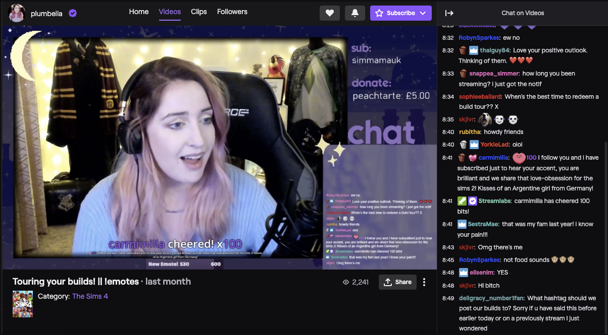
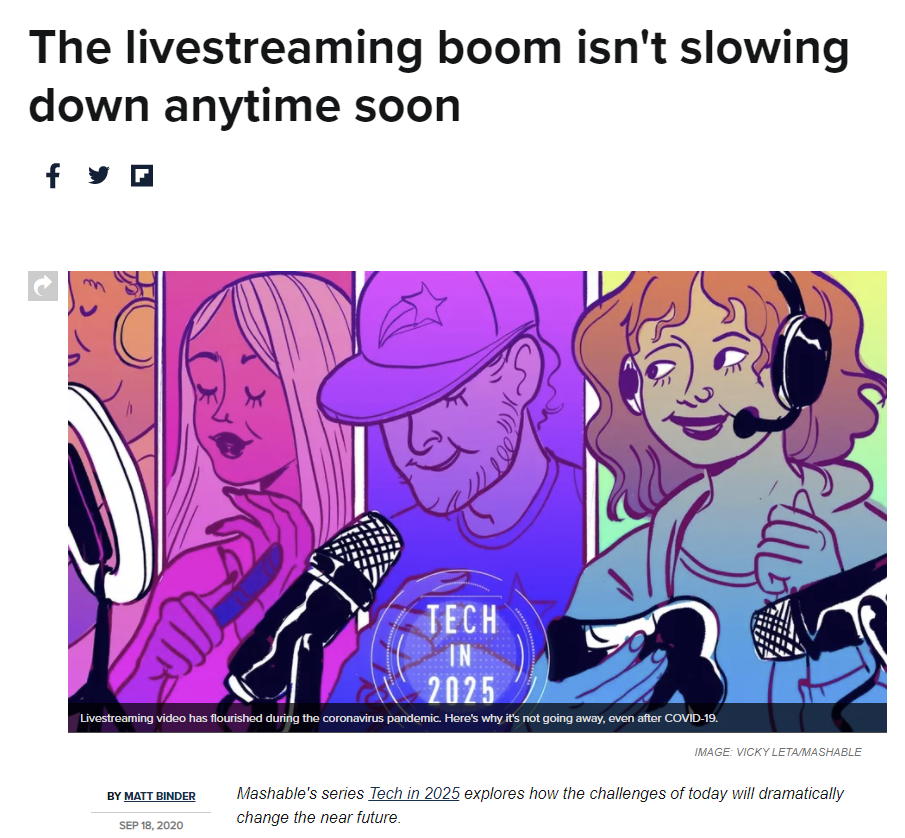
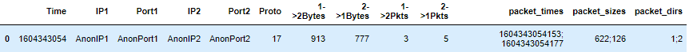
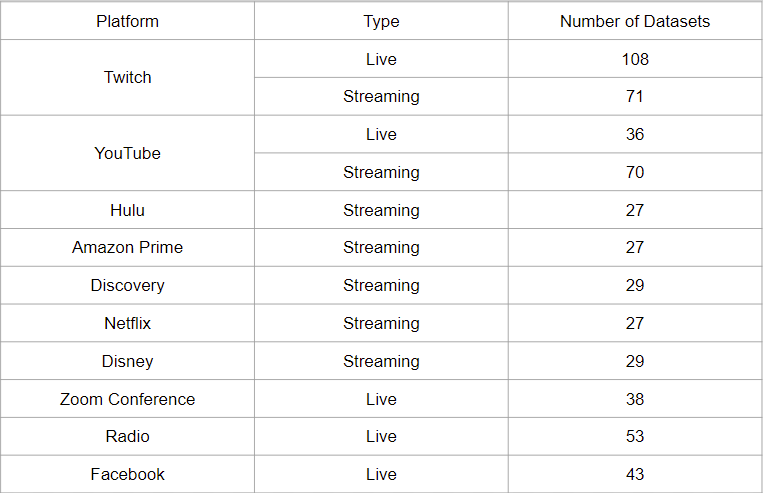
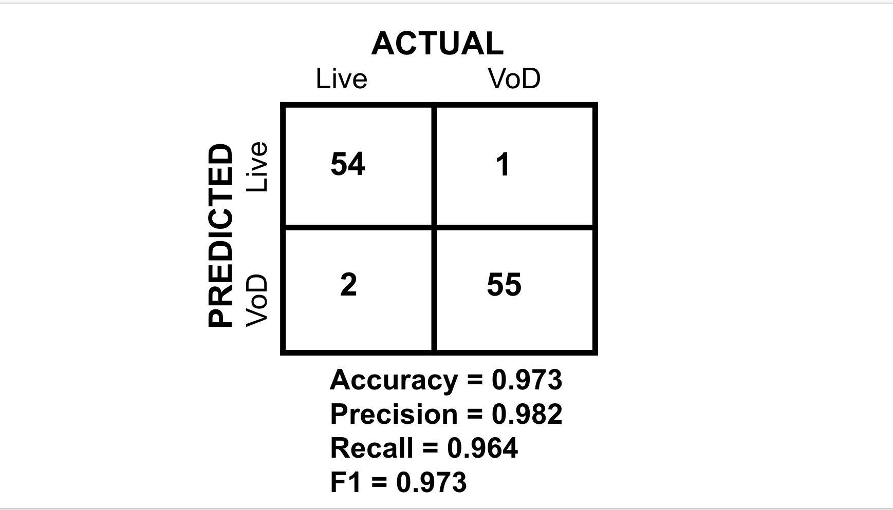
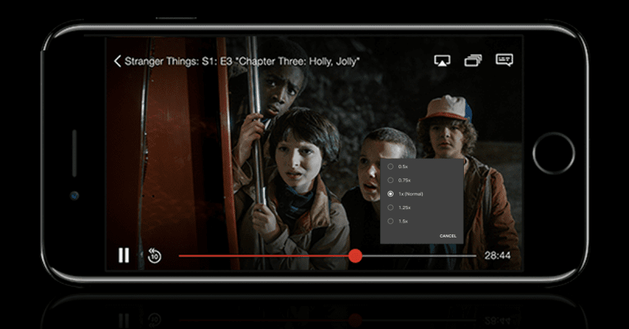

## Live vs. Video on Demand inside VPN Detection
&ensp; Created by: Da Gong, Andrey Pristinsky, Mariam Qader, Tianran Qiu, Zishun Jin

## Overview

&ensp; Due to the variety, affordability and convenience of online video streaming, there are more subscribers than ever to video streaming platforms. Moreover, the decreased operation of non-essential businesses and increase in the number of people working from home in this past year has further compounded this effect. More people are streaming live lectures, sports, news, and video calls via the internet at home today than we have ever seen before. 

(https://mashable.com/article/future-of-livestreaming/)

&ensp; In March 2020, YouTube saw a 2.5x increase in the amount of time people spent streaming live video. Twitch more than doubled their hours of content in three months after the start of the pandemic. There is a huge boom in the video content world, and it does not seem to be slowing down anytime soon.  Internet Service Providers, such as Viasat, are tasked with optimizing  internet connections and tailoring their allocation of resources to fit each unique customer’s needs. With this increase in internet activity, it would be especially beneficial for Viasat to understand what issues arise when customers stream various forms of video.

&ensp; This model is meant to be used in conjunction with another pipeline that can first verify that video streaming is occurring within a VPN tunnel. Using our findings, we can further classify what type of video a user is streaming, to help gain a better understanding of user activity to ultimately enhance user experience.

## Data Collection
&ensp; The internet data that we have collected consists of the number of packets and bytes uploaded and downloaded across a connection. A connection consists of the source and destination IP addresses and ports. Using this data, we can look at the flow of packets and bytes sent back and forth over time between the user and destination.With this information, and lots of exploratory data analysis we were able to find some key identifiers that can help us distinguish what type of video is being played. Below is an example file:

- **Time**: Timestamp when the data is recorded
- **IP1**: IP address of the user
- **Port1**:  Port of the user
- **IP2**: IP address of the server
- **Port2**: Port of the server
- **Proto**: IP Protocol number
- **1 ->2 Bytes**: The size in bytes of the packet in the upload direction
- **2 ->1 Bytes**: The size in bytes of the packet in the download direction
- **1 ->2 Pkts**: The number of Packets in the upload direction
- **2 ->1 Pkts**: The number of Packets in the download direction
- **packet_times**: The time when each packet arrived in milliseconds
- **packet_sizes**: The size in bytes of the packet excludes link layer headers
- **packet_dirs**: The direction where the packet came from. 1 means it is from IP1 (user). 2 means it is from IP2 (server).

## Dataset Overview
&ensp; We have chosen to generate network data from platforms that offer both live and VoD content, such as Youtube and Twitch, as well as data from platforms such as Netflix, Facebook Live, Radio.com, Amazon Prime, Hulu, and Zoom (live video calls). Through an extensive dataset drawing from multiple providers we were able to create a robust model that can identify when a user is streaming a VoD or a live video. The dataset breakdown is as follows:

## Feature Extraction & Analysis
&ensp; With the data we have generated, and lots of exploratory data analysis we were able to find some key identifiers that can help us distinguish what type of video is being played. We first want to compare the number of bytes that are downloaded when watching a video on demand vs. live video, this can give us insight on how different internet activities send their information.

&ensp; We can compare how twitch delivers their videos on demand vs their live videos in the graphs below:

.png)

&ensp; The graph above shows a side by side comparison of the number of downloaded bytes (how many bytes the destination IPs, Twitch here, sends back to the Source, aka the user) over a network for a five minute chunk (300 seconds) of Twitch Video on Demand and a Twitch Live Video. As we can see in the graphs above, there are some very prominent differences in the way VOD and Live Video is delivered. First, we can see that the graph for VOD is much more sparse than the one for live video. There is a spike of content delivered nearly exactly ten seconds apart, whereas for video on demand the spikes are very dense and content is delivered nearly every second. We can also see that the scale of bytes for the two videos differ. VOD has over two times as many bytes per spike, whereas live video has smaller spikes but more often.

&ensp; To quantify this difference in density between the two types of videos, we can look at the number of peaks present for bytes downloaded within a five minute chunk of video. The graphs below highlight where each spike is, using the mean number of bytes downloaded as a lowerbound. Using this lower bound can help us filter out any noise that can be present when collecting network data at lower magnitudes.

.png)
.png)

&ensp; It is clear that Live video has a much larger number of spikes than the VoD. To account for this in our model, we can create a feature that counts the number of spikes in a five minute video chunk.

&ensp; Another way to quantify this difference in density, is to look at how frequently these spikes are occuring. Below we can see a graph that plots what time each spike occurs for VoD and live Video. 

.png)

&ensp; As we can see above, the peaks for live video are much closer together than those for VoD. Each peak is about 10 seconds apart for VoD, whereas peaks for Live Videos are pretty consistently appearing. To account for this difference, we can draw out a feature that measures the time in seconds for the interval between peaks in a 5 minute chunk of video!
\\
\\
.png)

&ensp; When looking at the graph above, we can see that this data in the time domain binned at every 200 millisecond intervals looks quite different when comparing video on demand to live. The VOD data appears to be bursts, with way larger spikes than the live data, while the live appears to be more sporadic with the packet sizes coming in rapidly. One of the most interesting things was that we saw that VOD has a lot of packet sizes at zero, while live data has nearly no zeros. This led us to explore a possible feature packet zeros, as shown above the graph with the value counts for pct_zeros. The red horizontal line at the 0.01 threshold indicates that any value below 0.01 will be counted, with the VOD data having a large amount and live having basically zero.

&ensp; We can also look at the data in the frequency domain!
.png)

&ensp; This graph above shows the data for both VOD and live in the frequency domain. This means that we transformed the data, which we used Welch's method to compute. Right away we noticed that the peaks for VOD were way higher than live, as well as the height difference between the peaks and the troughs. From this, we developed a feature max prominence/mean which finds the largest height difference and normalizes it with the average power spectral density value. As well, we also looked into developing two other features, 0.1Hz/mean and 0.2Hz/mean. When zooming in, you can see that at every 0.1Hz and 0.2Hz, there are peaks or troughs which differed in sizes when looking at vod vs live. These Hz values showed enough of a difference between VOD and Live that we decided to find the minimum .1 and .2 Hz values present in each dataset and normalize them to create the potential features visible above the graph, with streaming on average having larger values than live.

## Features
&ensp; **The features we extracted that we have described above are as follows:**
- **Valid Packet Rate** - this feature finds the ratio of time that there is a valid packet being sent within the 5 minute chunk of video. This is created by grouping the data by the time column, to count the number of valid packets (packet size > 0) that are downloaded in the 2->1Bytes column in the five minute chunk of video. Then,this is calculated by dividing the number of valid packets with the total time. 
- **Number of Peaks** - This feature finds the number of  peaks that are greater than the mean of the 2 ->1 Bytes columns. It is calculated by the find_peaks method from the scipy library.
- **Interval gaps** - This feature looks at the total length of intervals between the peaks of the spikes in the 2 ->1 Bytes column. The peak of spikes is defined when the value is greater than the mean of the 2 ->1 Bytes column. And then, by subtracting the time difference between peaks, the length of intervals between peaks is calculated. Then, by summing the lengths of intervals, the total interval gaps are found. 
- **Packet Zeros** - This feature finds the percentage of packets that are zero (below the 0.01 threshold), with the % being the value returned per dataset. It is calculated by finding the total number of packets below the 0.01 threshold in the 2->1 direction multiplied by 100 then divided by the length of the binned 200 ms intervals.
- **Max Prominence / Mean** - This feature looks at the dataset in the frequency domain, then finds the maximum height present between a peak and trough and normalizes it. This normalized comparison is done in the 2->1 direction, and is calculated by binning the 2->1Packet Sizes into 200 millisecond intervals, applying Welch’s method to transform the data to the frequency domain, and then using a find peaks method to find the max prominence present in the dataset.
- **peak_0.1Hz_norm**  - This feature grabs the minimum .1Hz value found within the transformed data in the frequency domain and normalizes it. This spectral feature is calculated by binning the 2->1Packet Sizes into 200 millisecond intervals, and applies Welch’s method to transform the data to the frequency domain before looking at all the values occurring every 0.1Hz to find the minimum.
- **peak_0.2Hz_norm** - This feature grabs the minimum .2Hz value found within the transformed data in the frequency domain and normalizes it. This spectral feature is calculated by binning the 2->1Packet Sizes into 200 millisecond intervals, and applies Welch’s method to transform the data to the frequency domain before looking at all the values occurring every 0.2Hz to find the minimum.

## Model/Results 
&ensp; Using the features we have extracted, we then fed them through various supervised machine learning models to predict if live video or VoD streaming is occurring within a VPN tunnel. We trained each model with 80% of our data (446 datasets), and tested it with 20% (112 datasets). The data used for training/testing was decided randomly, to ensure a representative sample of platforms and classes (live vs VoD). 

&ensp; The model that performed the best was the Random Forest Classifier. Random forests is an ensemble learning method for classification that operates by constructing a multitude of decision trees at training time and outputting the class that is the mode of the classes (classification) or mean/average prediction (regression) of the individual trees. Random decision forests correct for decision trees' habit of overfitting to their training set. Normally, it will outperform the normal decision tree model which is the main reason we used it for our project. Following is the importance of each feature returned by the random forest model. The accuracy of this model is 97%.The confusion matrix can be seen below:

## Discussion
&ensp; Out of over 100 test data files, only 3 files were inaccurately classified with the wrong class label. The model has high accuracy, precision, recall and F1 scores, proving it to be robust and correct. It is also important to note that although this is the best model, the other models were able to achieve high accuracy scores as well. This shows that the features we chose to extract are very telling of how live video and VoD is delivered to users. We can also see that there are very dramatic differences in the way these two types of video content are sent, helping us achieve creating a strong model that is robust and generalizable. With this information, ISP’s can use our model in conjunction with others to get a better understanding of user streaming patterns and ultimately improve overall experience. 

## Future Work 
&ensp; As the project is finished, we are thinking about what further steps we can take to perfect our project, which includes improving the project’s comprehensiveness, effectiveness and ease of use. In the future, we will possibly cover more user scenarios to make the project more comprehensive, such as still image video versus action videos, high resolution video versus, low resolution video. Moreover, we can expand our project beyond video streaming, by exploring use cases like gaming, music streaming, video streaming etc. These added cases can hugely increase the usability and flexibility of our algorithm to reach out for a bigger market and to benefit users of different types. 

&ensp; As we think about these further steps, it is important to keep data ethics and privacy in mind. In the wake of data breaches and privacy concerns, VPNs are more popular today than ever before due to privacy concerns of users. Although it is justifiable for ISP’s to understand user traffic, by being able to identify game and music streams, to optimize connections and tailor services to their customer’s needs, there is a limit. The lengths we take to unravel the decryption procedure by VPN’s could start to make user’s uncomfortable, and must always be considered before we look at user data. 

&ensp; Traditional internet traffic investigations such as studying packet payloads are still very common amongst many companies, which is very ineffective. Due to the increasing amount of personal internet data and the popularization of the VPN, these traditional methods are hindered. Even if the methods work, the efficiency is worse compared to the ML algorithm and the user’s privacy is less protected. Therefore, we support these companies to keep up with the trend to update their back end services and incorporate ML into their algorithms. This will eventually save them time and energy, hence bringing more efficiency to their services as well as higher user satisfaction.

&ensp; In the end, the possible use case for our projects would be focused on companies like ISPs and VPN providers. Firstly, these companies have the ability to collect user data due to the nature of their services. Secondly, they have the pressing need to investigate user’s data, at the same time respect users’ privacy, in order to provide better internet services and ultimately enhance user experience. 

